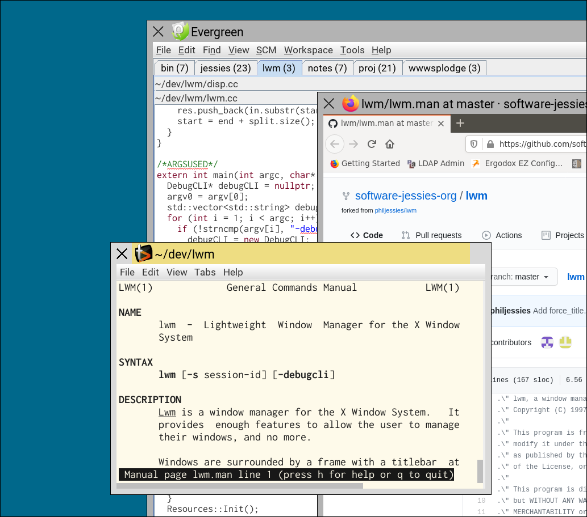

# lwm - the Lightweight Window Manager
===

LWM stands for Lightweight Window Manager. It is a window manager for the X11
window system. LWM has a limited feature set, and does not take on the tasks
that are better taken on by an independent program.

LWM is a classical reparenting window manager. This means it decorates client
windows with a title bar and border, and allows them to be moved and resized
by dragging these areas with the mouse.

IMPORTANT: If you run LWM the first time, note that you can start an xterm by
middle-clicking on the desktop background. If LWM is your own X11 process
running, this is really good to know, as it gives you a means to start other
programs.

## Principles of LWM

Once upon a time, LWM was simply the window manager that tries to keep out of
your face. This was Elliott's original paradigm, and it's a good one.

Since then, Phil's been doing much of the recent development, and has come to
add his own paradigm. Thus, LWM is the window manager that:

  * Keeps out of your face.
  * Puts you, the user, in control.

LWM will not attempt to second-guess you. It will not force unwanted features
on you. It will not take over responsibilities that are better undertaken by
some other program. It will behave in a simple, predictable manner.

It will also support features that put you more in control, such as the ability
for you to control window titles when you want to.

Essentially, you own this machine. It's yours. So it should damned well be doing
exactly what *you* want it to do.

## Features that LWM provides

### Moving/resizing

Using the fairly standard window borders and title bar, you can raise, move,
resize, close and iconise a window.

The left button will move the window from the title bar, or resize it from the
edges. The middle button will always move the window, but won't bring it to
the top of the window stack.

### Changing window stacking order

Left click on a window's title or border will bring it to the top of the window
stack; shift+right click on same will push it to the bottom.

### Hiding/unhiding windows

Also known as 'iconifying', except LWM doesn't clutter your desktop with icons.
Right-clicking (without Shift) on a window's title or border will make it
disappear.

Click+holding the right button on the desktop background opens a menu. At the
top of this menu (above the dotted line) are hidden windows. Visible windows are
shown below the dotted line.

Moving the mouse across this menu will show a red box around where the window
whose menu item you're pointing it will appear. Releasing the right button over
one of the menu items will make it appear, bring it to the top of the window
stack, and give it input focus.

### Configuration

You can configure things about LWM using Xresources. See the lwm.man page for
details, or look at the 'testXresources' file for an example.

Things you can configure include:

  * Colours. All of them.
  * Fonts and sizes.
  * Whether to display a pictorial icon (like a favicon) in the window title,
    or in the unhide menu.
  * Whether to use sloppy-focus or click-to-focus.
  * Border widths, and whether to include a resize border at the top of the
    title bar.
  * Commands to run when the user clicks left or middle buttons on the desktop
    background.
  * Commands to run when the user clicks left or middle buttons with the `Alt`
    key held, on the title bar of a window.

### XRandR support

LWM does not auto-detect monitors, or provide a UI to select monitor rotation,
location etc. However, it does understand the XRandR protocol, and when the
configuring of your monitors changes, it will react, ensuring windows are
sensibly arranged and that nothing gets lost off in some inaccessible corner.

One recommendation is to use a hotkey program like `speckeysd` to run a script
that sets up your screens with the xrandr command-line tool. That way you have
complete and explicit control over what happens, without relying on what can be
rather flaky screen auto-detection software.

### Other basic obvious stuff

  * UTF8 everywhere.

## Features that LWM does NOT provide

### Colourmaps

X still has support for colour maps. Well, LWM completely ignores them, and
doesn't fully support anything less than 24bpp displays. This does make modern
LWM unsuitable for ancient monochrome X terminals, but if you're using one of
those it's in a museum anyway, and you clearly don't mind not having the latest
version of LWM.

### Button bars

LWM is not an 'environment'. It is not a launcher. It is a window manager.
If you want a launcher, I'd suggest gummiband, but you can also use any other
launcher you like. This is the beauty of X11 - you can mix and match.

### Hotkeys

LWM has no hotkeys. It understands certain keyboard modifiers like Alt and
Shift, when combined with mouse actions, but it does not support hotkeys.
If you want to run programs on hotkey presses, consider using speckeysd.
Or, you can use any other hotkey program you like. This is the beauty of X11 -
you can mix and match.

### Virtual desktops

LWM doesn't support the EWMH protocol for virtual desktops. That is, the ability
to switch between multiple desktops, and have different clients visible on
different desktops.

There's no reason why LWM cannot support the protocol - it does, after all,
require the window manager's support to work - so if you really want this,
feel free to contribute support code. However, the UI stuff would be better
in a separate process.
